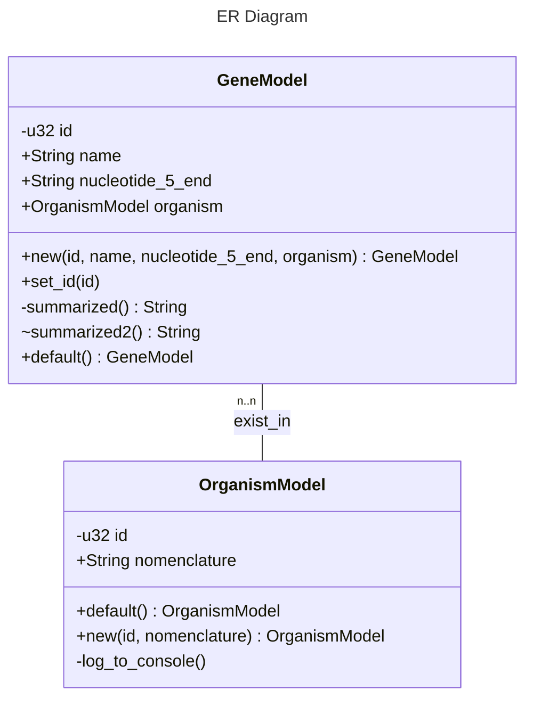

# Entity Relation Diagram (ERD) from Rust Struct

`erd_rs` is utility command-line tool for creating Entity Relation (ER) Diagram 
(or class/struct diagram) from codes written in Rust.

Properly documenting entity (or class) is a best practice in software development process. It enchance software maintainability, and allow developers to communicate effectively with team members and other stackholders. However, most developers prefer to express thier solution and idea through codes, instead of drawing. This command line takes Rust code as the source of truth to produce a entity relation diagram markdown file. This would saving thier time and energy for more coding.

## Get Started 👍

```bash
# install dependency command
cargo install cargo-expand

# display help message on how to use this command
erd_rs -h 
```

**Example Usage:**

Create mermaid markdown file (i.e., `ER.mmd`) from Rust source code in [`example-project`](./examples/example-project/).

```bash
erd_rs -d ./examples/example-project/
```

*Output:* See [ER.mmd](./examples/example-project/ER.mmd)

*Preview:*


